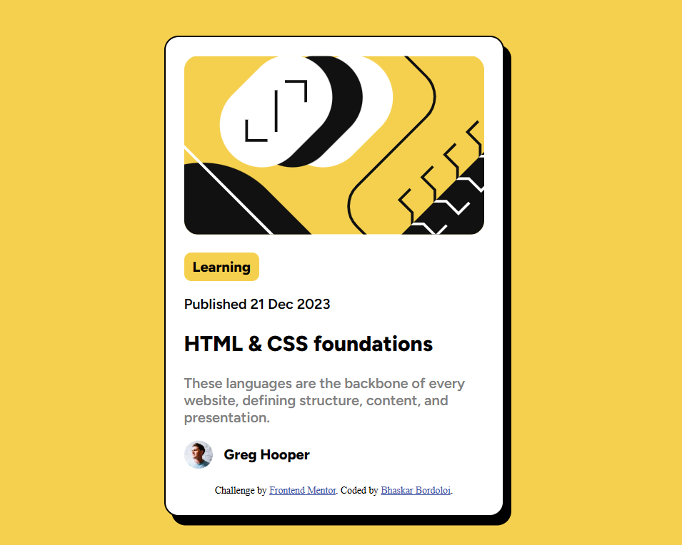

# Frontend Mentor - Blog preview card solution

This is a solution to the [Blog preview card challenge on Frontend Mentor](https://www.frontendmentor.io/challenges/blog-preview-card-ckPaj01IcS). Frontend Mentor challenges help you improve your coding skills by building realistic projects. 

## Table of contents

- [Overview](#overview)
  - [The challenge](#the-challenge)
  - [Screenshot](#screenshot)
  - [Links](#links)
- [My process](#my-process)
  - [Built with](#built-with)
  - [What I learned](#what-i-learned)
- [Author](#author)
- [Acknowledgments](#acknowledgments)

**Note: Delete this note and update the table of contents based on what sections you keep.**

## Overview

### The challenge

Users should be able to:

- See hover and focus states for all interactive elements on the page

### Screenshot

### Links

- Solution URL: [Github](https://github.com/bhaskrr/frontend-mentor-blog-preview-card)
- Live Site URL: [vercel](https://your-live-site-url.com)

## My process

### Built with

- Semantic HTML5 markup
- CSS custom properties
- Flexbox
- Mobile-first workflow

### What I learned

1.Learned how to add .ttf fonts to a project
2.Learned to use css flexbox

## Author

- Frontend Mentor - [@bhaskrr](https://www.frontendmentor.io/profile/bhaskrr)
- Github - [@bhaskar](https://github.com/bhaskrr)

## Acknowledgments

Used w3schools(https://w3schools.com) to check how to add .ttf fonts to a project
